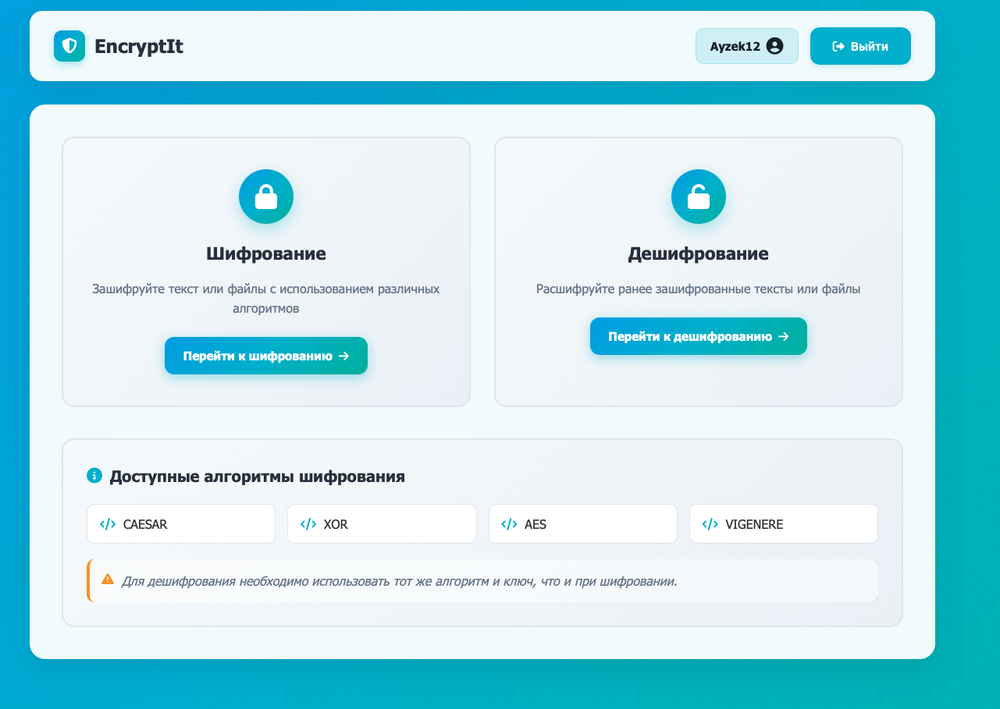
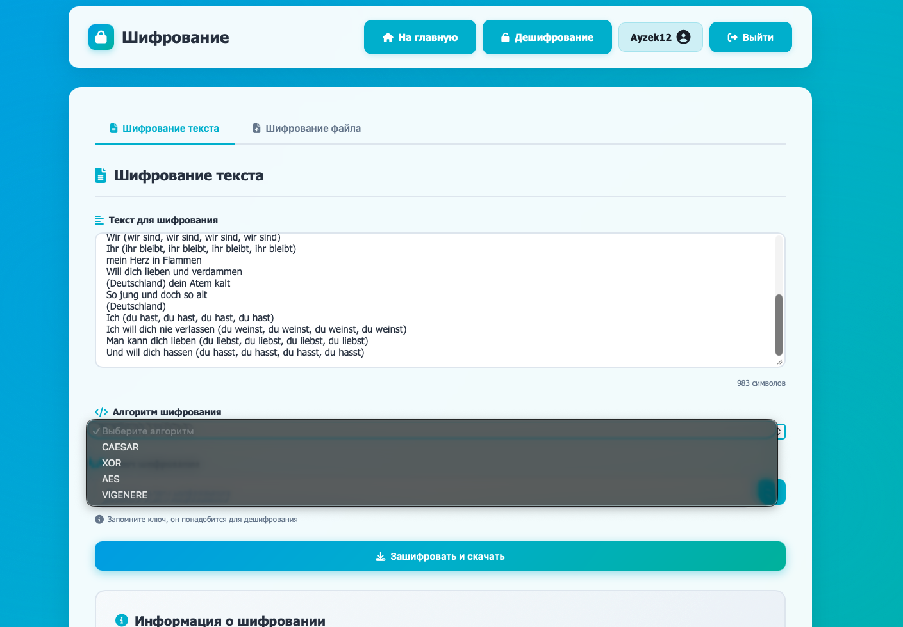
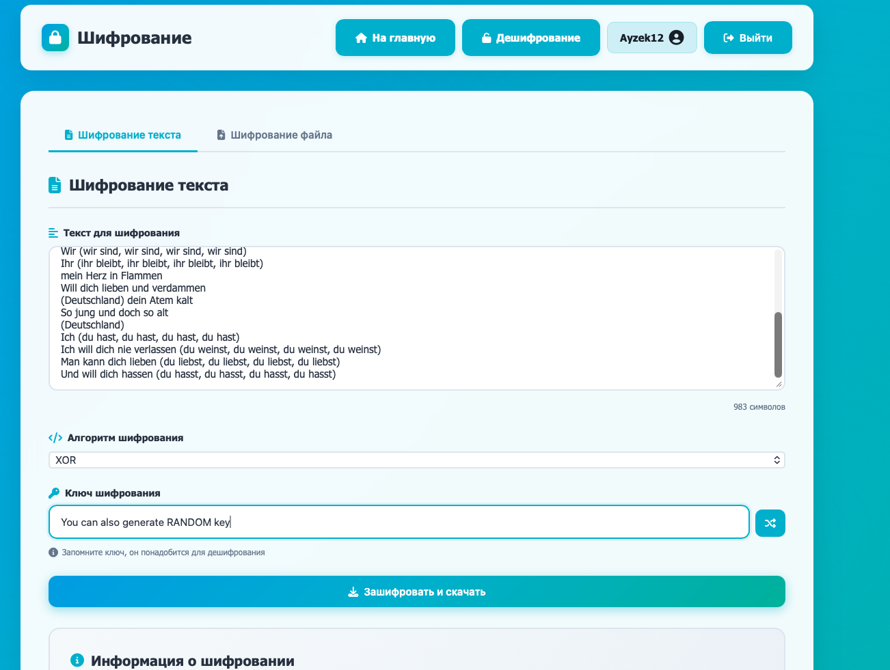
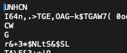
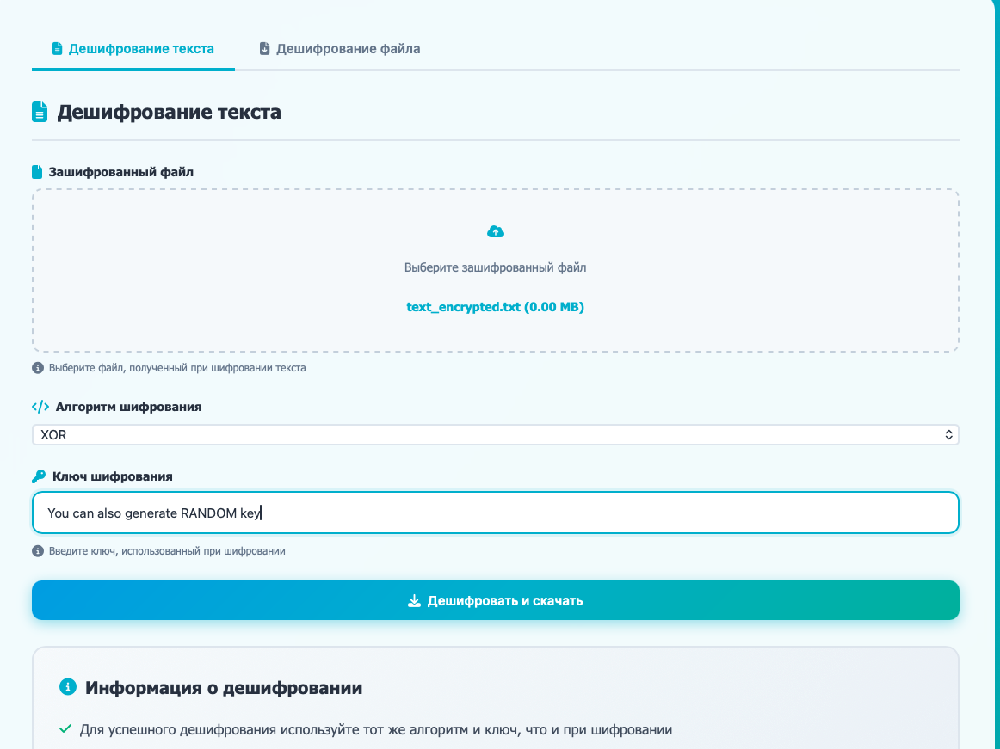
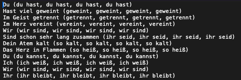

# 🔐 Encrypt-It

**Веб-приложение для шифрования файлов (Spring Boot)**

Веб-приложение, построенное на Spring Boot. Предоставляет защищенный интерфейс для шифрования и дешифрования текстовых и бинарных файлов с использованием множества криптографических алгоритмов. Включает полную систему аутентификации пользователей и контейнеризированную инфраструктуру для развертывания.

Пример использования на рисунках 1-7. Можно так же шифровать изображения :))
<div align="center">
<div style="text-align: center; margin: 40px 0;">
    
    <div style="margin-top: 10px; font-style: italic;">
        Рис.1: Домашняя страница
    </div>
</div>

<div style="text-align: center; margin: 40px 0;">
    
    <div style="margin-top: 10px; font-style: italic;">
        Рис.2: Страница шифрования данных 
    </div>
</div>

<div style="text-align: center; margin: 40px 0;">
    
    <div style="margin-top: 10px; font-style: italic;">
        Рис.3: Создание ключа и выбор алгоритма шифрования 
    </div>
</div>

<div style="text-align: center; margin: 40px 0;">
    
    <div style="margin-top: 10px; font-style: italic;">
        Рис.4: Зашифрованный текст
    </div>
</div>

<div style="text-align: center; margin: 40px 0;">
    
    <div style="margin-top: 10px; font-style: italic;">
        Рис.5: Страница дешифрования данных 
    </div>
</div>

<div style="text-align: center; margin: 40px 0;">
    
    <div style="margin-top: 10px; font-style: italic;">
        Рис.6: Скачать дешифрованный текст 
    </div>
</div>

<div style="text-align: center; margin: 40px 0;">
    
    <div style="margin-top: 10px; font-style: italic;">
        Рис.7: Дешифрованный текст 
    </div>
</div>
</div>

---

## Архитектура проекта и порядок работы

Приложение следует классической **слоеной архитектуре Spring Boot** (Controller-Service-Repository) с выделенным уровнем безопасности и утилитами.

## Технологический стек
- **Backend:**
  - `Java 21` — Основной язык.
  - `Spring Boot 3` — Каркас приложения (Web, Security, Data JPA).
  - `Spring Security` — Аутентификация и авторизация.
- **Data & Messaging:**
  - `PostgreSQL` — Основная реляционная база данных.
  - `Spring Data JPA` — Работа с БД.
  - `RabbitMQ` — Асинхронная обработка задач в очереди.
- **Infrastructure & Tools:**
  - `Gradle` — Сборка проекта и управление зависимостями.
  - `Docker` & `Docker Compose` — Контейнеризация и оркестрация сервисов (приложение, БД, RabbitMQ).
  - `Liquibase` — Управление миграциями базы данных.

### Основные компоненты (Java-пакеты)

| Пакет | Ключевые классы | Ответственность |
| :--- | :--- | :--- |
| **`controller/`** | `AuthController`, `EncryptionController` | REST API (конечные точки), обработка HTTP-запросов и ответов. |
| **`service/`** | `UserService`, `EncryptionService` | Содержит бизнес-логику (управление пользователями, организация процесса шифрования). |
| **`repository/`** | `UserRepository` (JPA-интерфейс) | Уровень доступа к данным для сущности `User`. |
| **`model/`** | `User` (JPA-сущность) | Модель данных, представляющая зарегистрированного пользователя в БД. |
| **`security/`** | `SecurityConfig`, `CustomUserDetailsService` | Настраивает Spring Security, аутентификацию и авторизацию. |
| **`util/encryption/`** | `AESEncryption`, `CaesarCipher`, `XORCipher`, `VigenereCipher` | Конкретные реализации алгоритмов шифрования. |
| **`config/`** | `RabbitMQConfig`, `WebConfig` | Конфигурация для очереди сообщений (RabbitMQ) и веб-настроек. |
| **`util/`** | `FileUtil` | Вспомогательные методы для работы с файлами. |

### Процесс шифрования
1.  **Аутентификация пользователя**: Пользователь регистрируется или входит через `AuthController`. `SecurityConfig` защищает все конечные точки.
2.  **Загрузка файла**: Аутентифицированный пользователь отправляет файл через конечную точку `/encrypt` или `/decrypt` в `EncryptionController`.
3.  **Сервисный слой**: `EncryptionService` получает запрос, проверяет его и выбирает подходящий класс-алгоритм из пакета `util/encryption/` (например, `AESEncryption`).
4.  **Выполнение алгоритма**: Выбранный шифр (`AESEncryption`, `CaesarCipher` и т.д.) выполняет криптографическую операцию над байтами файла.
5.  **Ответ**: Обработанный (зашифрованный/расшифрованный) файл передается обратно в браузер пользователя для скачивания.

### Модель данных и безопасность
*   **Пользователь (`model/User`)**: JPA-сущность, хранящаяся в PostgreSQL. Скорее всего содержит поля: `id`, `username`, `password` (хэширован с BCrypt) и `roles`.
*   **Безопасность (`security/`)**: `SecurityConfig` настраивает безопасность HTTP, процесс входа/выхода и управление сессиями. `CustomUserDetailsService` загружает данные пользователя для аутентификации.

### Фронтенд (Thymeleaf шаблоны)
Приложение использует серверный рендеринг с Thymeleaf:
*   `login.html`, `register.html`: Страницы аутентификации.
*   `dashboard.html`: Главная страница пользователя после входа.
*   `encrypt.html`, `decrypt.html`: Формы для загрузки файлов и выбора алгоритма.

---

## Быстрый старт

### Предварительные требования
*   Java 21
*   Gradle
*   Docker и Docker Compose (для развертывания в контейнерах)

### Локальный запуск (самый быстрый способ)
1.  **Соберите JAR-файл:**
    ```bash
    ./gradlew clean bootJar
    ```
2.  **Запустите через Docker Compose:** (Запускает приложение, PostgreSQL и RabbitMQ)
    ```bash
    docker-compose up --build
    ```
3.  **Откройте приложение:** Перейдите по адресу [http://localhost:8085](http://localhost:8085)

### Примеры использования API
Взаимодействуйте с бэкендом напрямую через `curl`:

**1. Регистрация пользователя:**
```bash
curl -X POST http://localhost:8085/api/auth/register \
  -H "Content-Type: application/json" \
  -d '{"username":"вашЛогин", "password":"вашПароль"}'
